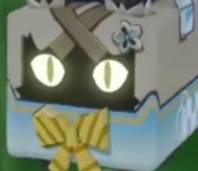

## 这是什么？
[绮良良](https://bbs.mihoyo.com/ys/obc/content/6594/detail?bbs_presentation_style=no_header)猫箱急件状态下的眼睛动画demo，参照下图制作：      

## 目前实现了什么效果
- 基于web的demo
- 瞳孔跟随焦点移动，带动整个眼睛运动
- 随机眨眼

## todo
- 瞳孔跟随焦点移动，带动整个眼睛运动
- 根据深度值变化调整瞳孔大小
- 增加原定的位移过程中通过控制控制点相对移动产生的眼睛方向性变化
- 转译到flutter
